# BrainUICL 精读笔记

> 论文：BrainUICL: An Unsupervised Individual Continual Learning Framework for EEG Applications  
> 会议：ICLR 2025  
> 论文文件：`D:\论文\AN UNSUPERVISED INDIVIDUAL CON.pdf`  
> 代码地址：论文摘要中给出 `https://github.com/xiaobaben/BrainUICL`  
> 关键词：EEG、BCI、无监督个体持续学习、持续域适应、稳定性-可塑性困境、伪标签、经验回放、KL 对齐

---

## 0. 先给结论

这篇论文要解决的是一个很实际的 EEG 应用问题：

> EEG 模型在实验室数据上训练好之后，到了真实场景会不断遇到新个体。每个人的 EEG 分布都不一样，而且新个体通常没有标签。模型既要快速适应这个新个体，又不能因为适应某个个体而损害对其他未见个体的泛化能力。

作者把这个问题定义为 **UICL, Unsupervised Individual Continual Learning，无监督个体持续学习**，并提出 **BrainUICL** 框架。

BrainUICL 的核心做法是：

1. 先用有标签源域个体训练一个初始 EEG 模型。
2. 新个体无标签到来时，复制当前模型得到一个 guiding model。
3. guiding model 用 CPC 自监督学习先适应当前个体。
4. guiding model 给当前个体生成高置信伪标签。
5. 主模型用当前个体伪标签 + 缓冲区样本一起微调。
6. 缓冲区采用 DCB，混合真实标签样本和高置信伪标签样本。
7. 训练过程中加入 CEA，每 2 个 epoch 用 KL divergence 对齐不同 epoch 的模型状态，防止过拟合当前个体。
8. 适应完成后，把当前个体中高置信伪标签样本加入存储，进入下一个个体。

一句话概括：

> BrainUICL 用“高置信伪标签 + 真实/伪标签混合回放 + 跨 epoch 分布对齐”来平衡 EEG 个体持续学习中的可塑性和稳定性。

---

## 1. 缩写和术语速查

| 缩写 | 全称 | 初学者解释 |
|---|---|---|
| EEG | Electroencephalography | 脑电信号，通过头皮电极记录大脑电活动 |
| BCI | Brain-Computer Interface | 脑机接口，用脑信号控制或辅助计算系统 |
| CL | Continual Learning | 持续学习，模型按时间不断学习新数据 |
| UICL | Unsupervised Individual Continual Learning | 无监督个体持续学习，本文提出的问题设定 |
| UDA | Unsupervised Domain Adaptation | 无监督域适应，用无标签目标域适配模型 |
| UCDA | Unsupervised Continual Domain Adaptation | 无监督持续域适应，目标域连续变化 |
| SP dilemma | Stability-Plasticity dilemma | 稳定性-可塑性困境 |
| Plasticity | 可塑性 | 模型适应新个体的能力 |
| Stability | 稳定性 | 模型保持/提升对未见个体泛化的能力 |
| DCB | Dynamic Confident Buffer | 动态置信缓冲区，本文模块之一 |
| CEA | Cross Epoch Alignment | 跨 epoch 对齐，本文模块之一 |
| CPC | Contrastive Predictive Coding | 对比预测编码，一种自监督学习方法 |
| ACC | Accuracy | 准确率 |
| MF1 | Macro-F1 | 宏平均 F1，适合类别不均衡时看整体分类效果 |
| AAA | Average Anytime Accuracy | 平均任意时刻准确率，用于评估稳定性 |
| AAF1 | Average Anytime Macro-F1 | 平均任意时刻 Macro-F1，用于评估稳定性 |

---

## 2. 论文解决了什么问题

### 2.1 现实问题：EEG 个体差异很大

EEG 是一种非侵入式脑机接口技术，可以用于：

- 睡眠分期
- 情绪识别
- 运动想象
- 疾病辅助诊断

但 EEG 有一个很麻烦的特点：**个体差异非常强**。不同人的生理结构、头皮电极接触、脑活动模式、采集噪声都可能不同。一个在训练集上表现不错的模型，换到新患者、新被试时，性能可能明显下降。

这篇论文认为，真实场景不是“训练一次，永远不变”，而是：

1. 先有一批带标签的源域个体，用来训练初始模型。
2. 之后不断有新个体出现。
3. 新个体没有标签。
4. 模型需要一个一个地适应这些新个体。
5. 适应过程中还要保持对其他未见个体的泛化能力。

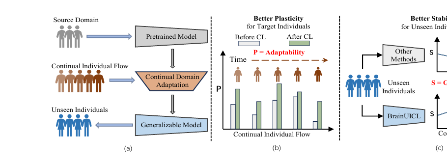

图 1 的含义：

- 左图：模型从源域出发，沿着连续个体流不断适应，最终希望变成对未见个体也泛化好的模型。
- 中图：可塑性 Plasticity 指模型对当前新个体的适应能力，适应后性能应提升。
- 右图：稳定性 Stability 指模型经过持续学习后，对其他未见个体的泛化能力不要下降，最好还能提升。

### 2.2 现有方法为什么无法直接解决

论文指出现有方法主要有四类不足。

第一，传统 EEG 深度模型通常参数固定。  
这类模型在源域训练好后直接部署，不能随着新个体到来继续学习。因此它们面对个体差异时泛化能力有限。

第二，普通无监督域适应 UDA 不是为长期连续个体流设计的。  
UDA 通常关注一次性从源域适应到目标域，但本文场景中目标域不是一个，而是很多个体一个接一个到来。

第三，传统持续学习 CL 往往默认任务标签或目标标签更明确。  
本文的新个体没有标签，直接套用监督持续学习并不现实。

第四，已有持续域适应 CDA/UCDA 方法通常假设域变化较小，或在样本级 batch 上研究。  
但 EEG 应用中，每个新个体都可能是一个差异明显的域，而且真实测试常常是“一个人一个人来”，因此应在个体级别建模。

更关键的是，EEG 场景存在稳定性-可塑性困境：

- 为了适应当前个体，模型需要改变参数，这提升可塑性。
- 但参数变太多，模型可能过拟合当前个体，损害对其他人的泛化，这降低稳定性。
- 如果当前个体是 outlier，模型还可能严重偏离原本学习轨迹，后续难以恢复。

---

## 3. 论文为什么会被提出

### 3.1 提出 UICL 的原因

作者提出 UICL，是因为 EEG 真实应用需要同时满足三个条件：

1. **个体级别**：每个 subject 被视为一个独立 domain。
2. **无监督**：新到来的个体没有人工标签。
3. **持续学习**：新个体按时间流连续出现，模型要不断更新。

这个设定比传统 UDA 或普通 CL 更贴近真实临床和脑机接口部署。

### 3.2 创新点

论文的主要创新点可以概括为三点。

第一，提出 EEG 场景下的 UICL 问题设定。  
这不是只换一个模型，而是重新定义了一个更现实的学习场景：连续到来的无标签个体流。

第二，提出 BrainUICL 框架。  
框架不要求修改模型结构，可作为 plug-and-play 方式应用在不同 EEG 任务上。

第三，提出两个关键模块：

- **DCB**：动态置信缓冲区，用真实标签样本和高置信伪标签样本混合回放，兼顾标签可靠性和样本多样性。
- **CEA**：跨 epoch 对齐，用 KL divergence 约束不同训练时刻的模型分布，防止模型过度偏向当前个体。

---

## 4. 方法总览

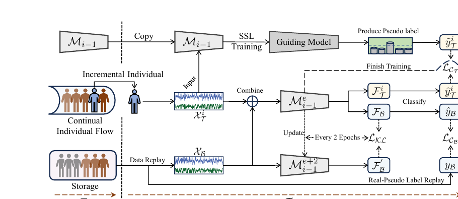

图 2 是整篇论文最重要的方法图。可以把 BrainUICL 看成一个循环过程。每当第 `i` 个新个体到来时，系统执行：

1. 当前模型为 $M_{i-1}$。
2. 复制 $M_{i-1}$ 得到 guiding model。
3. guiding model 在当前无标签个体上做 CPC 自监督训练。
4. guiding model 为当前个体生成高置信伪标签。
5. 从存储中心取出 buffer 样本 $X_B$。
6. 用当前个体样本 $X_T^i$ 和 buffer 样本联合训练主模型。
7. 每 2 个 epoch 执行一次 CEA，对齐不同 epoch 的模型分布。
8. 训练完成后得到 $M_i$。
9. 用 $M_i$ 给当前个体产生高置信伪标签样本，更新存储中心。
10. 等待下一个个体到来。

下面按执行顺序详细解释。

---

## 5. 实验方法逐步精读

## Step 1：问题设定

**快读流程**

论文把数据分成三部分：

- 预训练集 / 源域：有标签，用来训练初始模型 $M_0$。
- 增量集 / 连续个体流：无标签，一个个到来，用来做持续适应。
- 泛化集：有标签，只用于评估模型对未见个体的稳定性。

每个 subject 被当成一个 individual domain。模型的目标不是只适应当前人，而是适应很多新个体后，整体变成更强的泛化模型。

### 详细说明：问题形式和目标函数

论文把 EEG 数据按“个体 domain”来定义。也就是说，一个 subject 不是普通的一条样本，而是一个有自己分布的数据域。

源域 / 训练集定义为：

$$
D_S = \left\{\left(X_S^i, Y_S^i\right)\right\}_{i=1}^{N_S}
$$

这里 $D_S$ 表示 source domain，也就是预训练阶段使用的有标签个体集合；$X_S^i$ 表示第 $i$ 个源域个体的 EEG 样本，$Y_S^i$ 表示对应标签，$N_S$ 表示源域个体数量。

目标域 / 增量集定义为：

$$
D_T = \left\{X_T^i\right\}_{i=1}^{N_T}
$$

这里 $D_T$ 表示 target domain，也就是连续到来的无标签个体流；$X_T^i$ 表示第 $i$ 个新个体的 EEG 样本，$N_T$ 表示增量个体数量。注意这里没有 $Y_T^i$，因为论文设定中这些新个体没有真实标签。

泛化集定义为：

$$
D_G = \left\{\left(X_G^i, Y_G^i\right)\right\}_{i=1}^{N_G}
$$

这里 $D_G$ 表示 generalization set，用于评估模型对未见个体的稳定性；$X_G^i$ 是第 $i$ 个泛化集个体的 EEG 样本，$Y_G^i$ 是标签，$N_G$ 是泛化集个体数量。

这里的 $X$ 表示 EEG 样本，$Y$ 表示任务标签。比如睡眠分期任务中，标签可能是 Wake、N1、N2、N3、REM。

论文强调不同个体分布不同：

$$
P\left(D_T^i\right) \ne P\left(D_T^j\right),\quad 1 \le i \ne j \le N_T
$$

这个公式的意思是：第 $i$ 个新个体和第 $j$ 个新个体的 EEG 数据分布不同。它在实验中的角色是说明“个体差异为什么会造成持续域偏移”。如果每个人的 EEG 分布都一样，模型适应新个体就不会这么困难；正因为每个个体像一个不同 domain，模型才需要持续适应。

模型从初始模型 $M_0$ 开始，随着连续个体流逐步更新：

$$
M_0 \rightarrow M_1 \rightarrow \cdots \rightarrow M_i \rightarrow \cdots \rightarrow M_{N_T}
$$

这里 $M_0$ 是用源域 $D_S$ 训练出的初始模型；$M_i$ 表示模型已经适应到第 $i$ 个增量个体之后的状态。

论文写出的每轮理想目标是：

$$
\min_{\theta_M}\Bigg(
\underbrace{\mathbb{E}_{(X_T^i,Y_T^i)\sim D_T^i}
L\left(M\left(X_T^i\right),Y_T^i\right)}_{\text{适应当前个体，提升 Plasticity}}
+
\underbrace{\mathbb{E}_{(X_G,Y_G)\sim D_G}
L\left(M\left(X_G\right),Y_G\right)}_{\text{保持泛化能力，提升 Stability}}
\Bigg)
$$

其中 $\theta_M$ 是模型参数，$L(\cdot)$ 是任务损失。这个目标函数表达的是理想目标：第一项希望模型适应当前个体，提升可塑性；第二项希望模型在泛化集上保持好性能，提升稳定性。

注意：当前个体真实标签 $Y_T^i$ 在实际训练中不可见，因此后面会用伪标签 $\tilde{Y}_T^i$ 替代。论文先写理想目标，是为了说明 BrainUICL 要同时优化“学会当前人”和“不忘其他人”这两个方向。

简单例子：假设医院先用 30 个有标签患者训练模型，之后第 31 个患者来了但没有标签。模型要从这个患者的 EEG 中学习其个人特点，同时不能让模型对第 32、33、34 个未来患者的泛化能力变差。

---

## Step 2：初始模型预训练

**快读流程**

先用源域有标签数据训练一个 EEG 分类模型，得到初始模型 $M_0$。这个模型后续会不断适应新个体。

模型结构统一用于三个任务，主要由：

- CNN feature extractor
- Transformer feature encoder
- classifier

组成。

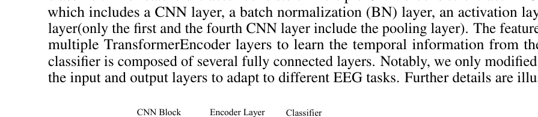

图 6 展示了作者使用的基础 EEG 模型。读图时可以按从左到右理解：原始 EEG 信号先进入 CNN block 提取局部波形特征，再进入 Transformer encoder 学习时间依赖，最后经过全连接分类器和 softmax 输出类别概率。

详细说明：模型结构和预训练角色

论文附录 B 说明模型由三部分组成：

1. **Feature extractor**：多个 CNN block，用来从 EEG 原始信号中提取局部特征。
2. **Feature encoder**：多个 TransformerEncoder layer，用来学习 EEG 序列中的时间依赖。
3. **Classifier**：全连接层 + softmax，输出类别概率。

预训练使用 cross-entropy loss。论文没有在正文中展开预训练交叉熵公式，因此这里不额外编造，只说明其角色：

- 输入：源域 EEG 样本 $X_S$。
- 监督信号：真实标签 $Y_S$。
- 输出：初始模型 $M_0$。

这个步骤解决的问题是：让模型在见到无标签新个体前，先具备基本 EEG 分类能力。

如果没有这一步，后面的伪标签质量会很差，因为模型一开始就不知道 EEG 信号和任务标签之间的关系。

---

## Step 3：新个体到来后，复制 guiding model

**快读流程**

当第 $i$ 个无标签个体到来时，当前主模型是 $M_{i-1}$。作者先复制它得到一个 guiding model $M_g$。

这个 guiding model 不直接作为最终模型，而是先用当前个体的无标签数据做自监督适应，再生成伪标签。

详细说明：为什么要单独用 guiding model

如果直接用 $M_{i-1}$ 给当前个体生成伪标签，伪标签可能质量不够好，因为当前个体与源域和之前个体存在域偏移。

作者因此复制一个 guiding model：

$$
M_g \leftarrow M_{i-1}
$$

然后只让 $M_g$ 先适应当前个体的分布。这样 $M_g$ 生成的伪标签更贴近当前个体。

这个步骤的角色是：提高无标签个体的伪标签质量，为后续主模型微调提供更可靠监督。

---

## Step 4：CPC 自监督训练生成伪标签

**快读流程**

由于当前个体没有标签，作者用 CPC 自监督学习让 guiding model 先适应当前个体。

CPC 的思想是：利用 EEG 序列的前面时间步去预测后面时间步。模型不需要人工标签，只需要 EEG 序列本身。

训练后，guiding model 对当前个体样本做分类预测，只保留 softmax 概率超过阈值 $\xi_1=0.9$ 的伪标签。

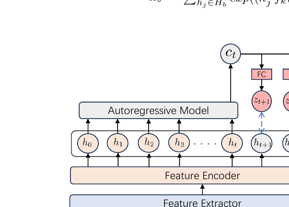

图 7 中，底部 EEG 经过 feature extractor 和 feature encoder 得到一串隐表示 $h_0,h_1,\ldots,h_t$。自回归模型把过去时间步压缩成上下文向量 $c_t$，再通过 FC 层预测未来表示 $z_{t+1},z_{t+2},z_{t+3}$。这就是“用过去预测未来”的自监督任务。

详细说明：CPC 公式和作用

论文附录 C 给出 CPC 过程。

设 feature encoder 输出的隐表示为：

$$
H=\{h_0,h_1,h_2,h_3,\ldots,h_t,h_{t+1},h_{t+2},h_{t+3}\}
$$

这里 $h_t$ 是第 $t$ 个时间步的 EEG 隐表示。

CPC 的目标是：用前面 $t$ 个时间步的表示 $H_{i\le t}$ 预测后续时间步 $H_{t\le i\le L}$。

论文使用 Transformer 作为 autoregressive model，把过去序列编码为上下文向量：

$$
c_t
$$

然后用线性层预测未来第 $t+k$ 个时间步：

$$
z_{t+k}=f_k(c_t)
$$

这里 $z_{t+k}$ 是对未来隐表示 $h_{t+k}$ 的预测。

CPC 损失为：

$$
L_{CPC}
= -\mathbb{E}_{H_b}\left[
\log
\frac{\exp\left(h_{t+k}^{T} f_k(c_t)\right)}
{\sum_{h_j\in H_b}\exp\left(h_j^{T} f_k(c_t)\right)}
\right]
$$

这个公式的角色是：让模型预测的未来表示 $f_k(c_t)$ 更接近真实未来表示 $h_{t+k}$，同时远离 batch 中其他负样本 $h_j$。

直观例子：  
如果一段 EEG 序列前半部分显示某种睡眠状态的连续模式，那么模型应能预测后续 EEG 表示。通过这个任务，模型无需标签也能学习当前个体的时序规律。

完成 CPC 后，guiding model 输出分类概率。若某样本最大类别概率超过 $\xi_1=0.9$，就认为这个伪标签足够可信，保留下来。

阈值太高：留下的伪标签太少。  
阈值太低：会引入大量错误伪标签。  
论文最终设置 $\xi_1=0.9$。

---

## Step 5：构建 DCB 动态置信缓冲区

**快读流程**

BrainUICL 使用 rehearsal-based 持续学习策略，也就是训练当前个体时回放一部分旧样本。

DCB 的存储中心有两类样本：

- $S_{true}$：源域训练集里的真实标签样本。
- $S_{pseudo}$：之前增量个体中保存下来的高置信伪标签样本。

每次训练当前个体时，从这两类样本中按 8:2 比例取 buffer。这样既保证标签可靠，又保留一定个体多样性。

详细说明：DCB 公式和作用

论文定义 buffer 样本：

$$
X_B = X_{S\in S_{true}} \cup X_{T\in S_{pseudo}}
$$

其中：

- $X_B$：本轮回放用的 buffer 样本。
- $S_{true}$：真实标签存储，来自源域训练集。
- $S_{pseudo}$：伪标签存储，来自之前增量个体。

论文采用 8:2 的选择比例：

- 80% 来自 $S_{true}$。
- 20% 来自 $S_{pseudo}$。

这个模块解决的是伪标签噪声问题。

如果完全依赖之前个体的伪标签，错误伪标签会不断进入训练，导致 error accumulation。  
如果只用源域真实标签，模型又缺少对已见增量个体的多样性回放。

因此 DCB 是一个折中：

- 真实标签样本提供可靠监督。
- 少量伪标签样本提供增量个体多样性。

训练完成后，当前模型 $M_i$ 会重新预测当前个体样本，只把概率超过阈值 $\xi_2=0.9$ 的样本加入 $S_{pseudo}$。

这个步骤在整个实验中充当“记忆系统”，帮助模型在学新个体时不忘旧知识，并减少无监督伪标签噪声。

---

## Step 6：当前个体与 buffer 联合训练

**快读流程**

主模型在每个新个体上微调 10 个 epoch。每个 batch 同时输入：

- 当前个体样本 $X_T^i$
- buffer 样本 $X_B$

当前个体用伪标签监督，buffer 样本用真实标签或保存的伪标签监督。

详细说明：交叉熵损失和权重 alpha

论文的分类损失为：

$$
L_C\left(M_{i-1},\theta;X_B,X_T^i,y_B\right)
= L_{CB}+\alpha L_{CT}
$$

展开为：

$$
L_C
= -\sum_c y_{Bc}\log \hat{y}_{Bc}
+ \alpha\left(-\sum_c \tilde{y}_{Tc}^{i}\log \hat{y}_{Tc}^{i}\right)
$$

逐项解释：

- $L_{CB}$：buffer 样本的分类损失。
- $L_{CT}$：当前个体样本的分类损失。
- $y_B$：buffer 样本标签，可能是真实标签，也可能是之前保存的伪标签。
- $\tilde{y}_T^i$：当前个体的伪标签。
- $\hat{y}_B$：模型对 buffer 样本的预测。
- $\hat{y}_T^i$：模型对当前个体样本的预测。
- $c$：类别索引。
- $\alpha$：当前个体损失的权重。

这个损失的角色是平衡两种训练目标：

1. 学当前个体：通过 $L_{CT}$ 提升可塑性。
2. 复习旧知识：通过 $L_{CB}$ 保持稳定性。

论文还设置了随持续学习进程变化的 $\alpha$：

$$
\alpha=
\begin{cases}
0.01, & i<n \\
0.1(\lg \frac{n}{i})+2, & i\ge n
\end{cases}
$$

论文文字说明：$\alpha$ 控制增量个体对模型的影响，并且随着持续学习进行，模型会逐渐稳定自己，增强对增量个体的惩罚，防止后期被某些个体过度牵引。

这里 $i$ 是当前第几个增量个体，$n$ 是训练集中涉及的个体数 $N_S$。

---

## Step 7：CEA 跨 epoch 对齐

**快读流程**

在当前个体上微调时，模型可能越来越贴合这个个体，甚至过拟合，尤其遇到 outlier 个体时更危险。

CEA 的做法是：每 2 个 epoch，把当前模型状态和前一个时间状态的预测分布做 KL 对齐，让模型不要偏离原学习轨迹太多。

详细说明：CEA 的 KL 公式和作用

论文定义同一个增量模型在不同 epoch 的状态：

- $M_{i-1}^{e}$：第 $e$ 个 fine-tuning epoch 的模型状态。
- $M_{i-1}^{e+2}$：第 $e+2$ 个 epoch 的模型状态。

它们对应的概率分布为：

$$
P(M_{i-1}^{e}),\quad P(M_{i-1}^{e+2})
$$

每 2 个 epoch，使用 KL divergence 对齐：

$$
L_{KL}\left(M_{i-1},\theta;X_B\right)
= D_{KL}\left(
P\left(M_{i-1}^{e}\right)
\parallel
P\left(M_{i-1}^{e+2}\right)
\right)
$$

KL divergence 用来衡量两个概率分布差异。这里它的角色是：

> 如果两轮训练后模型输出分布变化太大，就施加惩罚。

这不是把参数强行恢复，而是约束模型行为分布不要突变。作者认为这样比随机恢复参数更温和，因为不会把可能重要的参数直接重置。

简单例子：  
当前新个体 EEG 很特殊，模型若过度适应该个体，分类边界会大幅移动。CEA 会提醒模型：“可以适应，但不要让输出分布突然偏离之前状态太远。”

---

## Step 8：总体损失

**快读流程**

BrainUICL 的训练损失分两种情况：

- 普通 epoch：只用分类损失 $L_C$。
- 每 2 个 epoch：用分类损失 + KL 对齐损失。

详细说明：总体损失公式

论文总体损失为：

$$
L_{overall}
=
\begin{cases}
L_C, & e\bmod 2 \ne 0 \\
L_C + L_{KL}, & e\bmod 2 = 0
\end{cases}
$$

这里的 $e$ 表示第 $e$ 个 fine-tuning epoch。

根据论文上下文，表达的是每 2 个 epoch 加入一次 KL 对齐项。也就是说：

- 不需要对齐时，只做常规分类训练。
- 到达对齐间隔时，额外加入 CEA 约束。

这个总体损失把 BrainUICL 的两个核心目标合在一起：

1. 用 $L_C$ 学当前个体和回放样本。
2. 用 $L_{KL}$ 防止模型过度偏移。

---

## Step 9：更新存储中心并进入下一个个体

**快读流程**

当前个体训练完后，模型从 $M_{i-1}$ 更新为 $M_i$。

然后用 $M_i$ 重新预测当前个体样本，只保存高置信伪标签样本到 $S_{pseudo}$。之后模型进入下一个时间步，继续适应下一个个体。

详细说明：为什么训练后还要重新预测并存储

guiding model 生成的伪标签用于当前轮训练。训练结束后，主模型 $M_i$ 已经进一步适应当前个体，预测可能更好。因此作者用 $M_i$ 再次筛选高置信样本加入存储：

$$
S_{pseudo}
= S_{pseudo}\cup\left(\tilde{X}_T^i,\tilde{Y}_T^i\right)
$$

这样做的角色是：

- 把当前个体的高质量经验保存下来。
- 让后续个体训练时能回放更多个体分布。
- 但只保存高置信样本，减少错误累积。

这一步让 BrainUICL 从一次性适应变成持续适应。

---

## 6. 实验设置

### 6.1 数据集

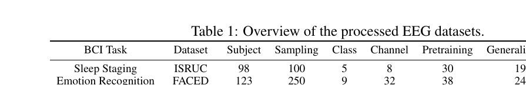

论文在三个主流 EEG 任务上验证：

| 任务 | 数据集 | 个体数 | 类别数 | 通道数 | 预训练/泛化/增量划分 |
|---|---|---:|---:|---:|---|
| 睡眠分期 | ISRUC | 98 | 5 | 8 | 30 / 19 / 49 |
| 情绪识别 | FACED | 123 | 9 | 32 | 38 / 24 / 61 |
| 运动想象 | Physionet-MI | 103 | 4 | 64 | 32 / 20 / 51 |

论文按约 3:5:2 划分：

- 3 份用于预训练。
- 5 份作为连续个体流。
- 2 份作为泛化集。

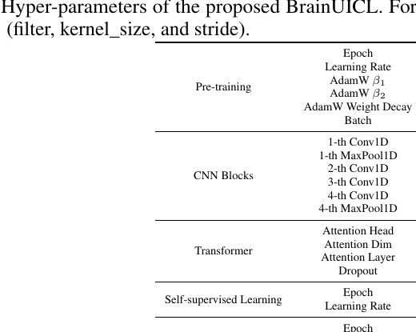

表 8 给出了主要复现参数：预训练 100 epoch，学习率 $1e-4$；自监督学习 10 epoch，学习率 $1e-6$；持续适应 10 epoch，学习率 $1e-7$；两个置信阈值 $\xi_1,\xi_2$ 都设为 0.9；CEA 对齐间隔为 2。

### 6.2 UICL 的时间过程

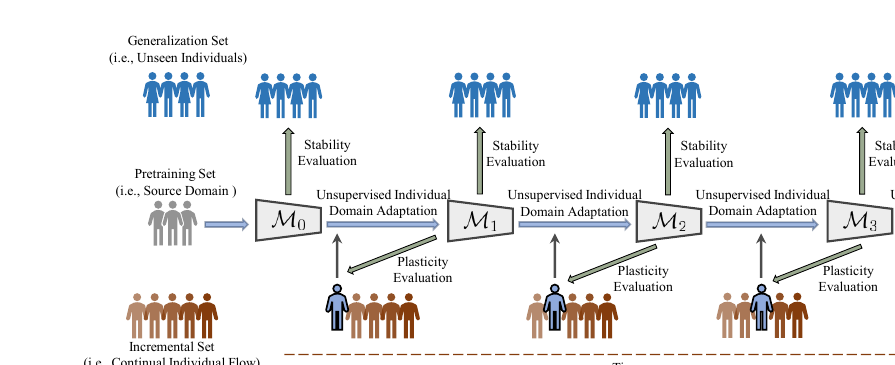

图 8 展示了更清楚的时间过程：

1. 用 pretraining set 训练 $M_0$。
2. $M_0$ 适应第一个增量个体，得到 $M_1$。
3. 评估 $M_1$ 对当前个体的可塑性。
4. 同时在 generalization set 上评估 $M_1$ 的稳定性。
5. 然后 $M_1$ 继续适应下一个个体。
6. 循环直到所有增量个体处理完。

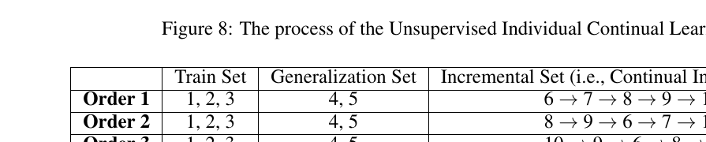

表 5 说明作者会改变增量个体出现顺序。原因是现实中新个体到来的顺序不可控，不同顺序会影响模型学习轨迹。

### 6.3 评估指标

论文评估两个方面：

- 可塑性：模型对当前增量个体的表现，用 Average ACC 和 Average MF1。
- 稳定性：模型对泛化集的表现，用 AAA 和 AAF1。

AAA 和 AAF1 公式为：

$$
AAA_i
= \frac{1}{i}\sum_{j=1}^{i}
\frac{1}{N_G}\sum_{k=1}^{N_G}
ACC\left(\hat{Y}_{G,k}^{j},Y_{G,k}\right)
$$

$$
AAF1_i
= \frac{1}{i}\sum_{j=1}^{i}
\frac{1}{N_G}\sum_{k=1}^{N_G}
MF1\left(\hat{Y}_{G,k}^{j},Y_{G,k}\right)
$$

这两个指标的作用是：不是只看最后一个模型，而是看持续学习过程中每个阶段模型对泛化集的平均表现。

初学者可以这样理解：

- ACC/MF1 看“当前人学得怎么样”。
- AAA/AAF1 看“学了很多人以后，对其他人还能不能泛化”。

---

## 7. 实验结果详细解读

## 7.1 总览结果：可塑性和稳定性都提升

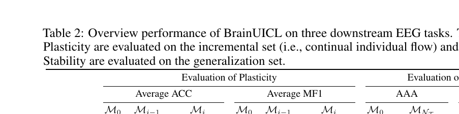

表 2 比较了三个时间状态：

- $M_0$：初始模型，未适应当前个体。
- $M_{i-1}$：适应当前个体之前的模型。
- $M_i$：适应当前个体之后的模型。

核心观察：

1. **可塑性提升明显**  
   ISRUC 的 Average MF1 从 57.6 提升到 70.0，提升 13.4。  
   FACED 的 Average MF1 从 17.6 提升到 37.1，提升 19.5。  
   Physionet-MI 的 Average MF1 从 44.6 提升到 47.4，提升 2.8。

2. **稳定性没有下降，反而提升**  
   FACED 的 AAA 从 24.0 提升到 36.5，AAF1 从 18.7 提升到 34.5。  
   这说明模型不是只记住当前个体，而是在持续适应中吸收了对其他个体也有用的知识。

3. **Physionet-MI 提升较小**  
   这可能是因为初始模型在该任务上已经较强，后续增量空间较小。

这个结果直接支撑论文主张：BrainUICL 能同时改善可塑性和稳定性。

## 7.2 与现有方法对比

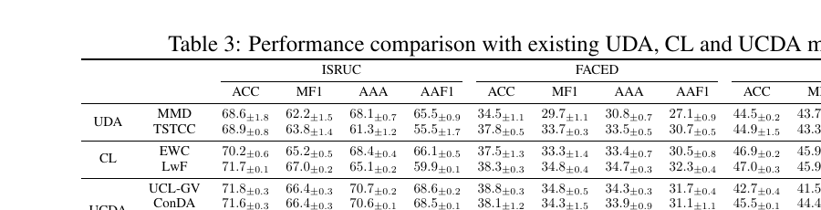

表 3 比较了三类方法：

- UDA：MMD、TSTCC。
- CL：EWC、LwF、UCL-GV。
- UCDA：ConDA、CoTTA、ReSNT。
- 本文：BrainUICL。

主要结论：

- BrainUICL 在三个数据集上整体取得最优或接近最优表现。
- 在 ISRUC 上，BrainUICL 达到 ACC 74.9、MF1 69.9、AAA 74.0、AAF1 72.0。
- 在 FACED 上，BrainUICL 达到 ACC 40.3、MF1 36.8、AAA 36.0、AAF1 33.9。
- 在 Physionet-MI 上，BrainUICL 达到 ACC 48.4、MF1 47.5、AAA 48.7、AAF1 48.3。

为什么 UDA 表现较差？  
UDA 主要解决一次性目标域适应，不擅长连续个体流下的长期稳定性。

为什么普通 CL 不够？  
普通 CL 能缓解遗忘，但本文目标个体无标签，而且每个个体域差异明显。

为什么 UCDA 仍不够？  
UCDA 考虑持续变化域，但现有方法没有针对 EEG 个体级无监督流设计高质量伪标签与稳定性约束。

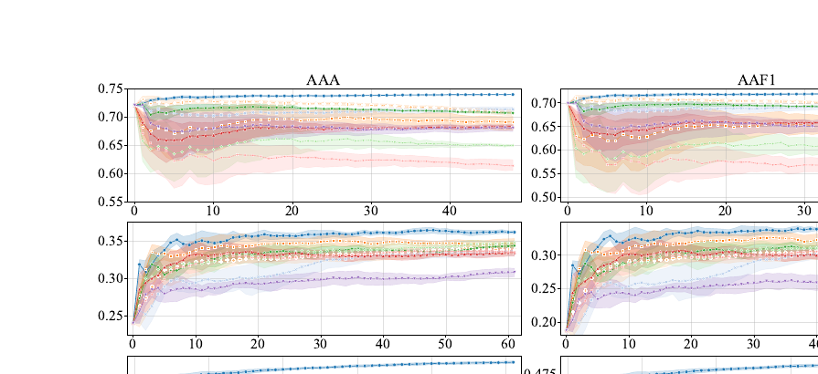

图 4 展示每个增量个体到来后，模型在泛化集上的 AAA 和 AAF1 变化。

读图方式：

- 横轴：连续个体流中的个体顺序。
- 纵轴：AAA 或 AAF1。
- 中间线：五种随机输入顺序下的平均值。
- 阴影：95% 置信区间。
- 蓝色线：BrainUICL。

关键现象：

- ISRUC 和 Physionet-MI 上，多数对比方法曲线有下降趋势，说明持续适应可能损害泛化。
- BrainUICL 的蓝色曲线整体更高，并且趋势更平稳。
- FACED 上所有方法大多上升，但 BrainUICL 后期仍明显领先。
- 阴影区域逐渐收窄，说明 BrainUICL 对不同输入顺序更稳健。

图 4 支撑一个重要结论：BrainUICL 不只是最后分数高，它在持续学习全过程中都比较稳定。

## 7.3 消融实验：DCB 和 CEA 都有效

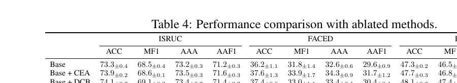

表 4 比较：

- Base：去掉 DCB 和 CEA。
- Base + CEA：只加 CEA。
- Base + DCB：只加 DCB。
- BrainUICL：DCB + CEA 都加。

结果说明：

- 单独加入 DCB 或 CEA，大多数指标都有提升。
- 完整 BrainUICL 最好。
- DCB 对可塑性贡献更明显，因为它直接改善当前个体训练所用的回放样本。
- CEA 对稳定性贡献重要，因为它限制模型过度偏向当前个体。

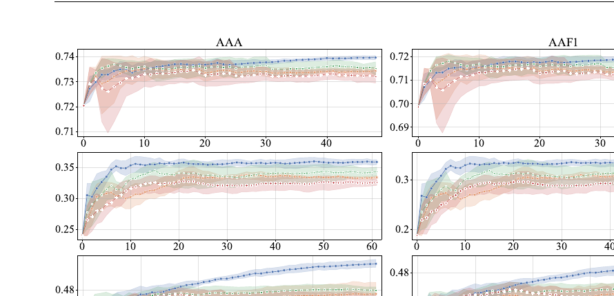

图 5 进一步展示：

- 蓝色 BrainUICL 曲线通常最高。
- Base 曲线较低，说明没有 DCB/CEA 时持续适应能力不足。
- DCB 和 CEA 单独使用都有效，但组合效果更好。

论文中有一个值得注意的观察：即使不断给增量个体施加惩罚，BrainUICL 的可塑性仍然更好。这说明稳定性约束并没有简单地阻止学习，反而避免了模型被异常个体带偏，使后续适应更顺畅。

## 7.4 DCB 比例实验：为什么选 8:2

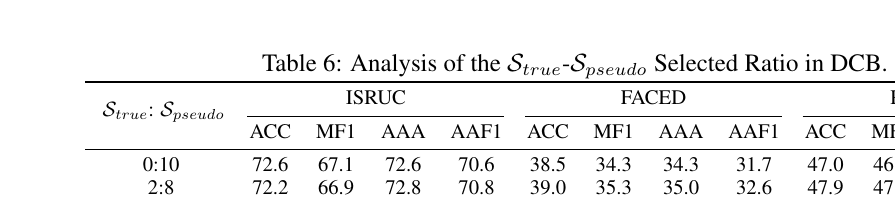

表 6 比较 $S_{true}:S_{pseudo}$ 的比例。

结论：

- 8:2 在大多数情况下取得最好稳定性-可塑性平衡。
- 10:0 只用真实标签样本，有时可塑性不错，但稳定性不如 8:2，例如 FACED AAA 为 35.6，低于 8:2 的 36.5。
- 0:10 全靠伪标签样本，整体明显变差，说明伪标签噪声会累积。

解释：

- 真实标签样本可靠，但多样性不足。
- 伪标签样本来自增量个体，能带来多样性，但有噪声。
- 8:2 是偏向可靠标签、同时保留个体多样性的折中。

## 7.5 CEA 间隔实验：为什么每 2 个 epoch 对齐

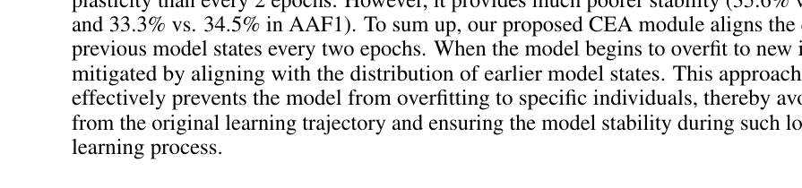

表 7 比较每 1、2、3、4、5 个 epoch 对齐一次。

主要结论：

- 每 2 个 epoch 对齐在多数情况下最好。
- 对齐太频繁，例如每个 epoch，都可能惩罚太强，使模型适应当前个体的能力下降。
- 对齐太少，例如每 4 或 5 个 epoch，模型更容易受当前个体影响，稳定性下降。

简单理解：

- CEA 太强：模型不敢学新个体。
- CEA 太弱：模型容易被新个体带偏。
- 每 2 个 epoch 是论文实验中较好的折中。

## 7.6 Outlier 个体分析

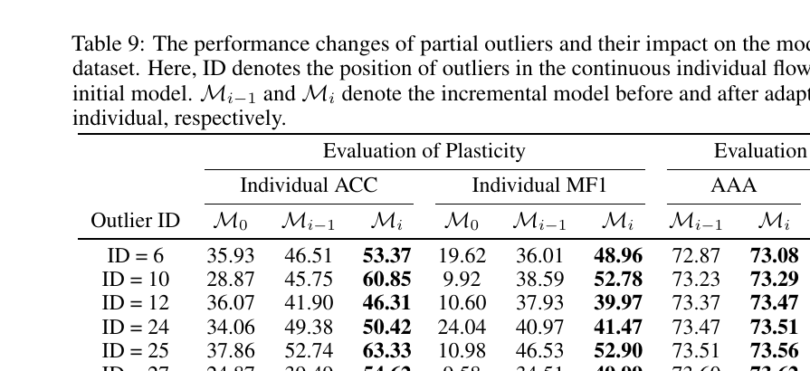

表 9 分析 ISRUC 中部分 outlier 个体。

观察：

- 这些 outlier 在初始模型 $M_0$ 上表现很差。例如 ID=37 的 Individual ACC 只有 20.83。
- 经过前面持续学习后，适应前模型 $M_{i-1}$ 已经比 $M_0$ 好很多。
- 再经过当前个体适应后，$M_i$ 进一步提升。
- 同时 AAA 和 AAF1 也保持小幅上升，没有因为适应 outlier 而崩掉。

这说明 BrainUICL 对异常个体有一定鲁棒性。它不是看到 outlier 就灾难性遗忘，而是通过 DCB 和 CEA 控制更新幅度。

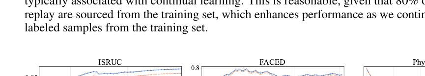

图 10 展示训练集在持续学习过程中的表现变化。论文解释说，训练集只用于初始预训练，不参与后续持续学习；但由于 DCB 中 80% replay 来自训练集真实标签样本，训练集性能整体没有出现典型持续学习中的灾难性遗忘。

## 7.7 与其他 memory sampling 方法比较

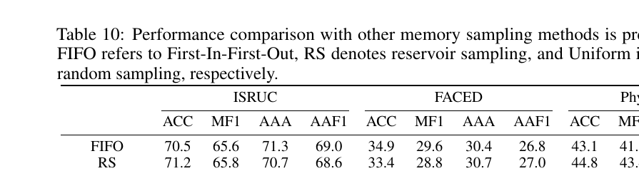

表 10 比较：

- FIFO：先进先出。
- RS：reservoir sampling，蓄水池采样。
- Uniform：均匀随机采样。
- Ours DCB：本文动态置信缓冲区。

结果：

- DCB 在三个数据集上几乎所有指标最好。
- FACED 上 DCB 的 MF1 为 37.1，明显高于 Uniform 的 33.3。
- Physionet-MI 上 DCB 的 AAF1 为 48.5，高于 FIFO 的 43.2。

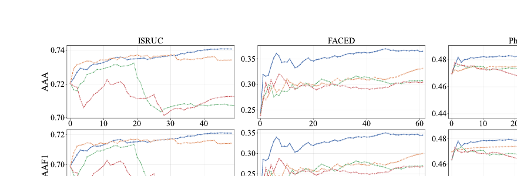

图 11 可以看到：

- FIFO 曲线容易下降，原因是过度依赖最近个体，遇到 outlier 后不容易恢复。
- Uniform 早期还可以，但随着伪标签样本越来越多，低质量样本会增加，后期性能可能下降。
- DCB 因为主动控制真实标签和伪标签比例，并筛选高置信伪标签，所以更稳定。

## 7.8 数据划分鲁棒性

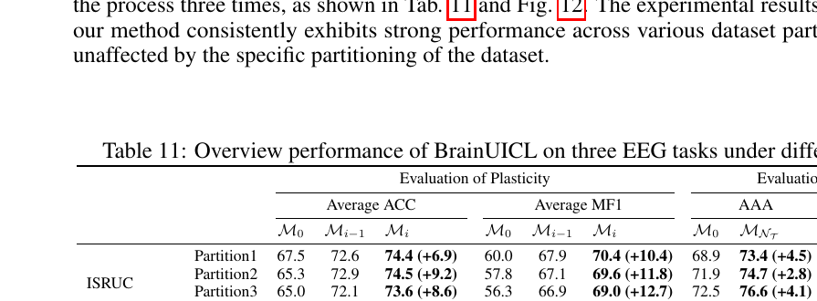

表 11 检查不同数据划分下 BrainUICL 是否仍有效。

结论：

- 不同 partition 下，BrainUICL 仍能在可塑性和稳定性上取得提升。
- 说明结果不是只依赖某一次偶然划分。

这一点增强了实验可信度。

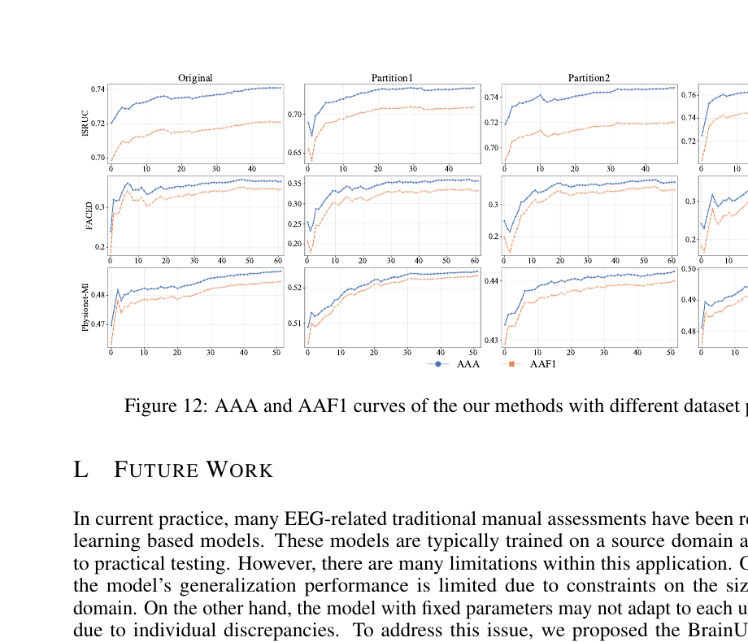

图 12 进一步说明，不同数据划分下 AAA 和 AAF1 曲线整体仍保持相似趋势。也就是说，BrainUICL 的效果不是只在 original partition 上成立，而是在多次随机划分中都能保持相对稳定。

## 7.9 计算成本

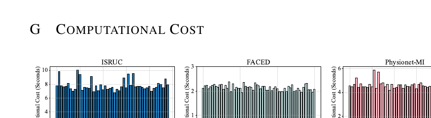

图 9 展示每个增量个体的适应耗时。论文报告的平均耗时大致为：

- ISRUC：7.814 秒
- FACED：2.140 秒
- Physionet-MI：4.588 秒

这说明 BrainUICL 的单个体适应成本在作者实验环境下是秒级的。对于真实 EEG 应用来说，这一点很重要，因为临床或脑机接口系统通常不能等待很长时间才能适配一个新用户。

不过，这里也要谨慎：论文没有把不同硬件环境、部署端设备、数据预处理延迟都展开讨论。因此“秒级适应”可以说明方法有实际应用潜力，但还不能等同于已经完成真实临床部署验证。

---

## 8. 论文缺陷与可改进方向

### 8.1 任务范围仍有限

论文只验证了三个 EEG 任务：

- 睡眠分期
- 情绪识别
- 运动想象

作者在 Future Work 中也承认，其他 EEG 任务的公开数据集规模较小，因此尚未覆盖更多应用。

可改进方向：

- 扩展到抑郁症诊断、疲劳检测、意识障碍诊断等任务。
- 在真实临床连续数据上验证，而不只是公开数据集重划分。

### 8.2 伪标签仍可能引入噪声

虽然 DCB 使用置信阈值过滤伪标签，但高置信不等于正确。模型可能对错误预测也很自信。

可改进方向：

- 引入不确定性估计。
- 使用多模型一致性筛选伪标签。
- 对伪标签样本设置动态权重，而不是简单保留/丢弃。

### 8.3 超参数依赖较明显

论文中关键超参数包括：

- $\xi_1=0.9$
- $\xi_2=0.9$
- DCB 比例 8:2
- CEA 间隔 2 epoch
- $\alpha$ 调度策略

这些设置在三个数据集上有效，但换到其他 EEG 任务或设备时未必最优。

可改进方向：

- 自动调整 DCB 比例。
- 根据当前个体难度动态调整 CEA 强度。
- 使用验证信号或无监督指标选择伪标签阈值。

### 8.4 对存储成本和隐私问题讨论不足

DCB 需要保存源域真实样本和部分增量个体伪标签样本。EEG 是敏感生理数据，真实部署中存储用户脑电数据可能涉及隐私和合规问题。

可改进方向：

- 使用特征级 replay，减少原始信号存储。
- 使用隐私保护训练方法。
- 研究不存储个体数据的持续学习替代方案。

### 8.5 评估仍主要是离线模拟

论文通过随机划分和打乱顺序模拟连续个体流，但真实应用中可能还会有：

- 设备变化。
- 电极脱落或噪声。
- 标签体系变化。
- 长时间跨天漂移。
- 用户状态变化。

可改进方向：

- 在线部署实验。
- 跨设备、跨医院、跨采集协议验证。
- 更长时间跨度的连续 EEG 测试。

### 8.6 方法解释性仍可增强

BrainUICL 表现更好，但论文对模型到底学习了哪些 EEG 模式解释不多。

可改进方向：

- 可视化不同个体适应前后的特征空间。
- 分析 DCB 中被选中的样本类型。
- 分析 CEA 对不同层、不同类别的影响。
- 对 outlier 个体做生理或信号质量层面的解释。

---

## 9. 汇报时可以这样讲

如果你要做组会汇报，可以按下面顺序讲：

1. EEG 模型真实部署困难：个体差异大，新个体不断出现且无标签。
2. 传统固定模型、UDA、CL、UCDA 都不能完整解决这个问题。
3. 作者提出 UICL：无监督、个体级、持续学习。
4. BrainUICL 的目标是同时提升 Plasticity 和 Stability。
5. 方法分三块：伪标签生成、动态缓冲区、跨 epoch 对齐。
6. CPC 负责让 guiding model 适应当前无标签个体，生成更可信伪标签。
7. DCB 负责用真实标签和伪标签混合回放，减少噪声并保留多样性。
8. CEA 负责防止模型过拟合当前个体，尤其是 outlier。
9. 实验显示三个 EEG 任务上 BrainUICL 整体优于 UDA、CL、UCDA 方法。
10. 消融和附录实验说明 DCB、CEA、8:2 比例、2 epoch 对齐都有实验证据支撑。
11. 局限是任务范围有限、伪标签仍有噪声、超参数依赖、隐私存储和真实在线验证不足。

---

## 10. 最后总结

这篇论文的价值不在于提出一个特别复杂的新网络结构，而在于它把 EEG 真实应用中的一个关键痛点建模清楚：

> 新个体不断出现、没有标签、个体差异大、模型还必须越用越稳。

BrainUICL 的设计很有工程直觉：

- 用 CPC 解决当前个体无标签适应问题。
- 用 DCB 解决伪标签噪声和持续学习遗忘问题。
- 用 CEA 解决过拟合当前个体和 outlier 冲击问题。

实验结果表明，它在三个 EEG 任务上能同时提升当前个体适应能力和未见个体泛化能力。对于初学者来说，读这篇论文最重要的是理解一个思想：

> 持续学习不是盲目学习新数据，而是在“吸收新知识”和“保持旧能力”之间设计约束。

